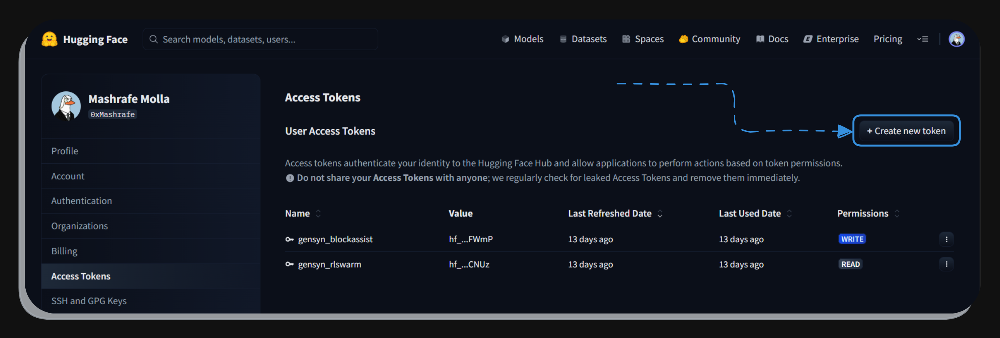
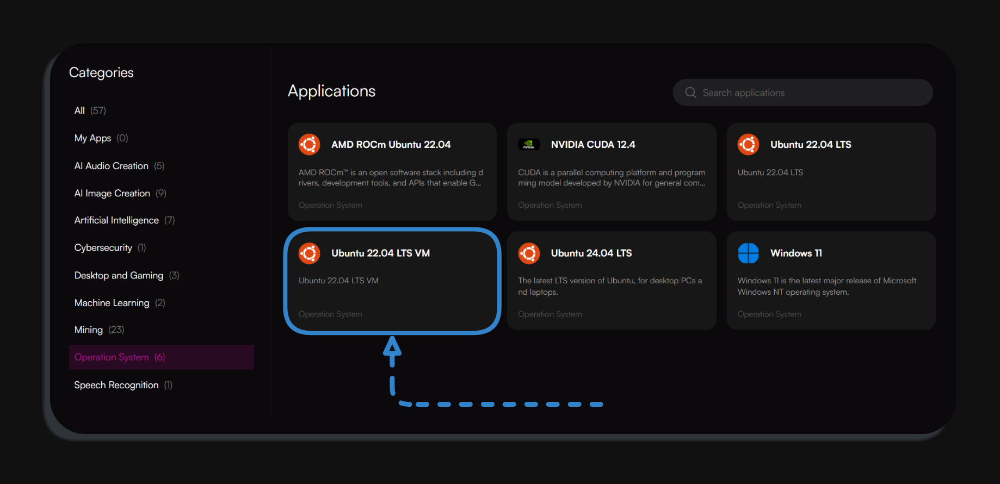
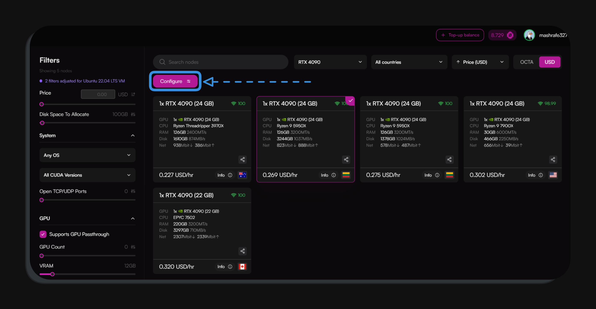
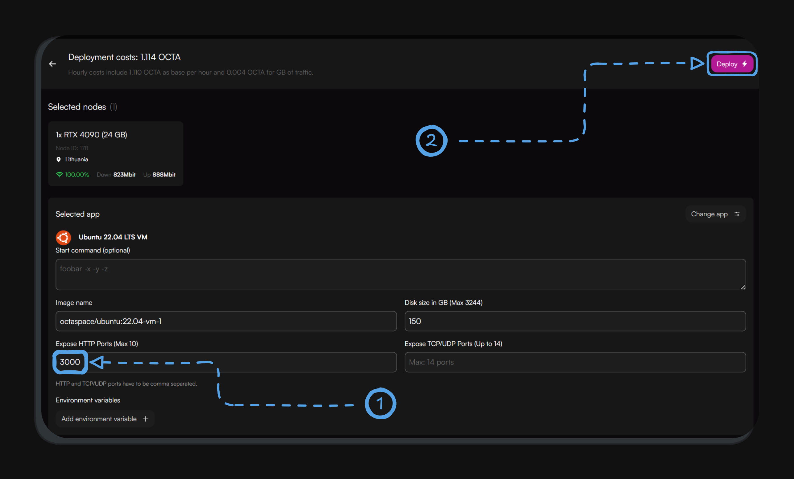
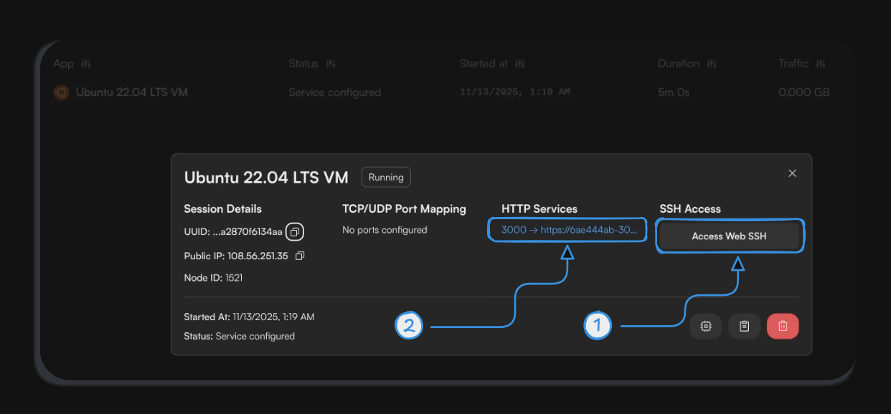
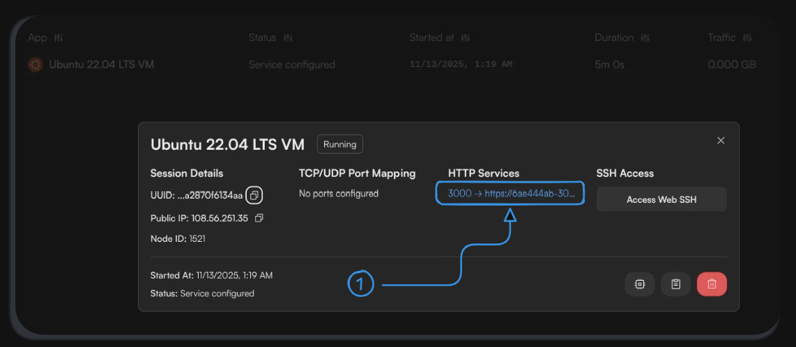

# Run CodeAssist on Octa-Space
This guide provides a simple and beginner-friendly way to run **Gensyn CodeAssist** on **OctaSpace**, using clear steps and visual references.  
Follow the steps below to get CodeAssist running in just a few minutes.


---

## Step 1: Create Your HuggingFace Token

<p>
  
</p>

To run CodeAssist, you'll need a HuggingFace access token.

1. Go to: https://huggingface.co  
2. Sign in → Click your **Profile**  
3. Open **Settings → Access Tokens**  
4. Click **New Token**  
5. Set:
   - **Name:** CodeAssist (for example)  
   - **Permissions:** Write (must)  
6. Click **Create**  
7. Copy the token immediately and keep it safe. (you won’t be able to see it again)

---

## Step 2: Choose Your Octa VM

<p>
  
</p>

Now we'll select the virtual machine that will run CodeAssist.

1. Go to: https://marketplace.octa.space  
2. Navigate to **Operation System**  
3. Select **Ubuntu 22.04 LTS VM**  
4. Choose any GPU node that suits your needs  
   - A GPU with **12–24 GB VRAM** is recommended for smoother performance  
   - But you may select any available GPU  
5. Press **Configure** to continue to the deployment settings

---

## Step 3: Configure Your Deployment

<p>
  
</p>
  Before deploying your instance, we need to expose the correct port.
 <p>
  
</p>

1. In the **Expose HTTP Ports** field, enter **3000**  
2. Review your selected node and settings  
3. When everything looks correct, press **Deploy**  
4. Wait until the session status changes to **Running**

---

## Step 4: Access Web SSH & Install CodeAssist

<p>
  
</p>

Once your instance is running, open a terminal on it to begin installation.

1. Open your **Session Details**  
2. Click **Access Web SSH** to launch the terminal  
3. Run the following commands one by one:

```bash
# install system dependencies
apt update && apt install -y docker.io docker-compose git

# install uv (astral) helper and load its environment
curl -LsSf https://astral.sh/uv/install.sh | bash
source "$HOME/.local/bin/env"

# clone the CodeAssist repository
git clone https://github.com/gensyn-ai/codeassist.git
cd codeassist

# start CodeAssist
uv run run.py
```

Authenticate & Wait for CodeAssist to Start

After the installer starts running:

1. You will be asked to enter your **HuggingFace token**  
   - Paste it (it might not show on screen)  
2. Press **Enter**  
3. Wait for the installation to complete  
4. When you see **"CodeAssist Started"**, everything is ready

---

## Step 5: Open the CodeAssist Web Interface

<p>
  
</p>

Once CodeAssist has started, you can open it directly in your browser.

1. Wait until the terminal shows **"CodeAssist Started"**  
2. Return to your **Session Details** on Octa  
3. Under **HTTP Services**, click the link for port **3000**  
4. The CodeAssist Web UI will open in a new tab

---

After the Web UI opens, you can begin using CodeAssist immediately.  
For guidance on features, workflows, and best practices, refer to the official documentation:

https://docs.gensyn.ai/testnet/codeassist/using-codeassist
